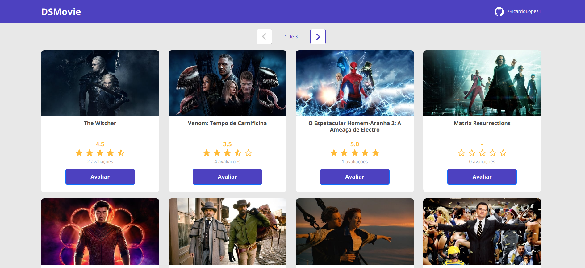
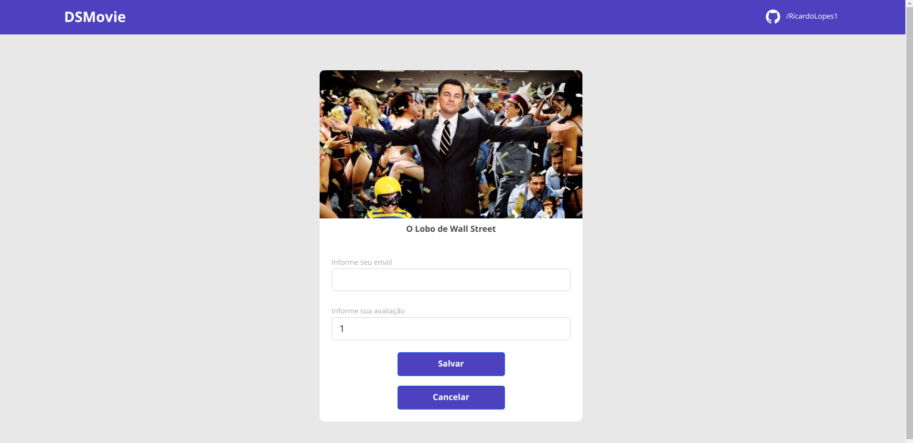
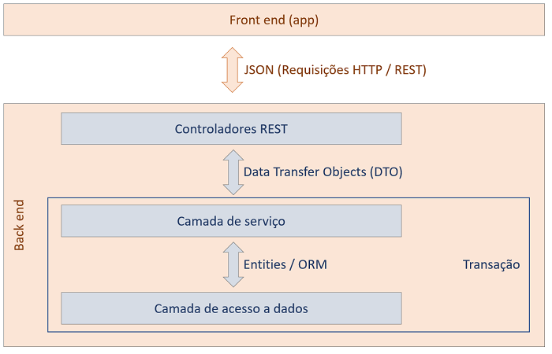
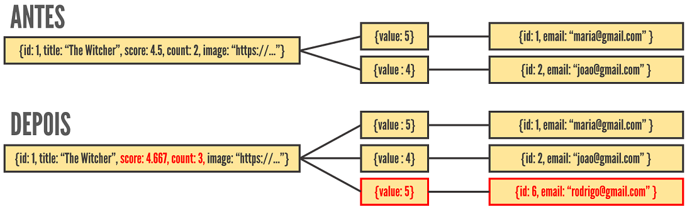

# DSMovie
[](https://github.com/RicardoLopes1/dsmovie/blob/main/LICENSE)
# Sobre o projeto

<p><a href="https://rlopes-dsmovie.netlify.app/" target="_blank">
https://rlopes-dsmovie.netlify.app/</a>
</p>

DSMovies é uma aplicação *Web* construída durante a 7ª edição da **Semana Spring React** (#sds7), evento organizado pela [DevSuperior](https://learn.devsuperior.com "Site da DevSuperior"). 

Esta aplicação consiste em uma tela inicial com a listagem dos filmes que estão no banco de dados, e uma segunda tela onde é possível avaliar o filme escolhido utilizando um e-mail válido. É cadastrado apenas uma avaliação por e-mail, sendo possível redefinir sua avaliação reavaliando o filme utilizando o mesmo e-mail já usado.

## Layout web




# Padronização do modelo back-end

## Modelo conceitual


## Padrão camadas adotado


## Lógica para salvar avaliação


# Tecnologias utilizadas
## Back-end
<p align="left"> 
<a href="https://maven.apache.org" target="_blank">  </a> 
<a href="https://www.java.com" target="_blank">  </a>
<a href="https://pt.wikipedia.org/wiki/Java_Persistence_API" target="_blank">  </a>
<a href="https://spring.io/" target="_blank">  </a>
</p>

## Front-end
<p align="left"> 
<a href="https://github.com/axios" target="_blank">  </a> 
<a href="https://getbootstrap.com" target="_blank">  </a>
<a href="https://www.w3schools.com/css/" target="_blank">  </a> 
<a href="https://www.w3.org/html/" target="_blank">  </a> 
<a href="https://reactjs.org/" target="_blank">  </a>
<a href="https://www.typescriptlang.org/" target="_blank">  </a>
</p>

# Implantação em produção
## Back-end
<a href="https://heroku.com" target="_blank">  </a> 

## Front-end 
<a href="https://www.netlify.com" target="_blank">  </a> 

## Banco de dados 
<a href="https://www.postgresql.org" target="_blank">  </a>
<a href="#">  </a> 

# Como executar o projeto

## Back-end
Pré-requisitos: Java 17

```bash
# clonar repositório
git clone git@github.com:RicardoLopes1/dsmovie.git

# entrar na pasta do projeto back-end
cd backend

# executar o projeto
./mvnw spring-boot:run
```

## Front-end
Pré-requisitos: npm / yarn

```bash
# clonar repositório
git clone git@github.com:RicardoLopes1/dsmovie.git

# entrar na pasta do projeto front end
cd frontend

# instalar dependências
yarn

# executar o projeto
yarn start
```

## Autor
Paulo Ricardo da Silva Lopes
<p align="left">
<a href="https://linkedin.com/in/paulo-ricardo-da-silva-lopes-092406197" target="_blank"></a>
<a href="https://fb.com/ricardosilva31" target="_blank"></a>
<a href="https://www.instagram.com/oricardo.lopes/" target="_blank">  </a> 
</p>

## Agradecimentos
[DevSuperior - escola de programação](https://learn.devsuperior.com "Site da DevSuperior").
<p align="left">
<a href="https://instagram.com/devsuperior.ig" target="_blank">  </a> 
<a href="https://youtube.com/devsuperior" target="_blank">  </a>
</p>
